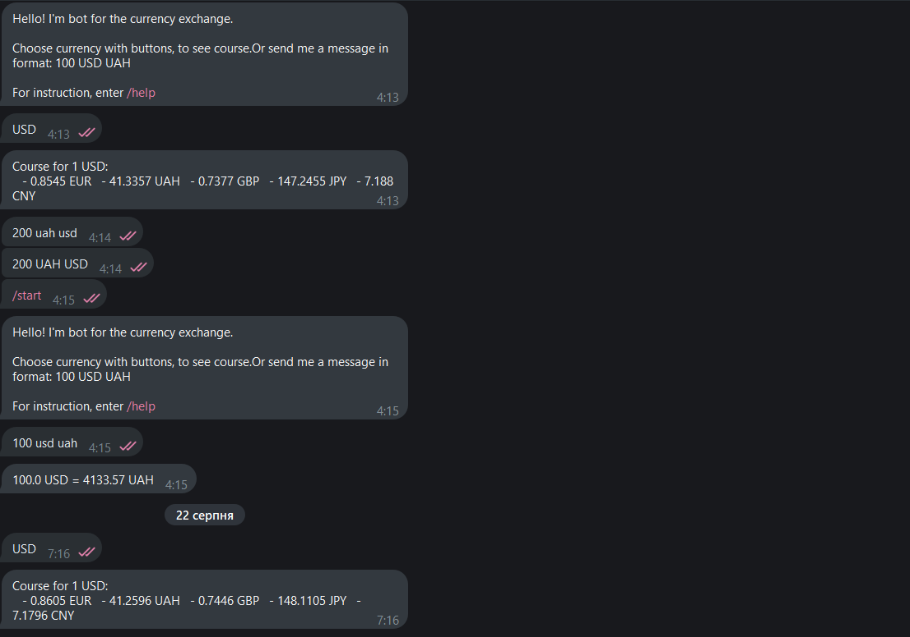

# Currency Converter Telegram Bot


A simple and user-friendly Telegram bot that provides real-time currency exchange rates and conversion.

---

### Demo



---

### Features

*   **Quick Rates:** Get instant exchange rates for popular currencies by simply clicking a button.
*   **Precise Conversion:** Convert any amount from one currency to another using a simple command format (e.g., `100 USD RUB`).
*   **Interactive Keyboard:** A clean and easy-to-use reply keyboard for quick access to major currencies.
*   **Real-time Data:** Fetches up-to-date exchange rates from the [ExchangeRate-API](https://www.exchangerate-api.com/).

---

### How to Use

1.  **Find the bot on Telegram:** [ExchangeBot](https://t.me/aod13_bot)
2.  **Press `/start`:** The bot will greet you and show a keyboard with popular currencies.
3.  **Get Quick Rates:** Press any currency button (e.g., `USD`) to see its value against other major currencies.
4.  **Convert a Specific Amount:** Just send a message in the format `[amount] [from_currency] [to_currency]`.
    *   Example: `150 GBP JPY`

---

### Setup and Run Locally

Want to run this bot yourself? Here is how you can do it.

**1. Prerequisites**
*   Python 3.10 or higher
*   Git

**2. Clone the Repository**
```bash
git clone https://github.com/freddieBear13/exchange-bot
cd telegram-currency-bot
```

**3. Create a Virtual Environment**
```bash
# For Windows
python -m venv venv
venv\Scripts\activate

# For macOS/Linux
python3 -m venv venv
source venv/bin/activate
```

**4. Install Dependencies**
```bash
pip install -r requirements.txt
```

**5. Set Up Environment Variables**

I didn't really found free hostings, so you can try it on your own telegram bot or watch demo

**6. Run the Bot**
```bash
python bot.py
```

The bot should now be running and responsive in Telegram!
